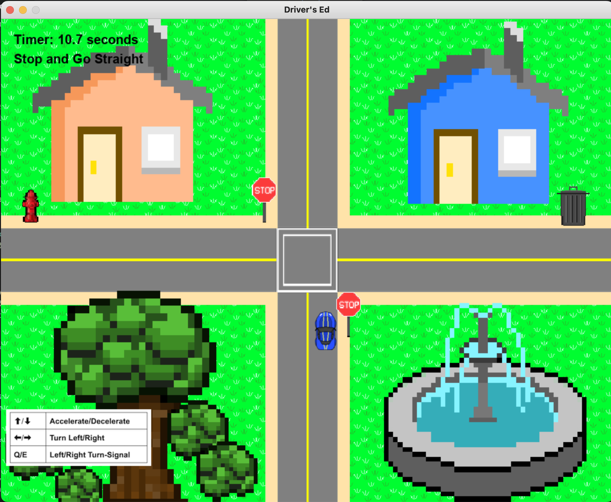
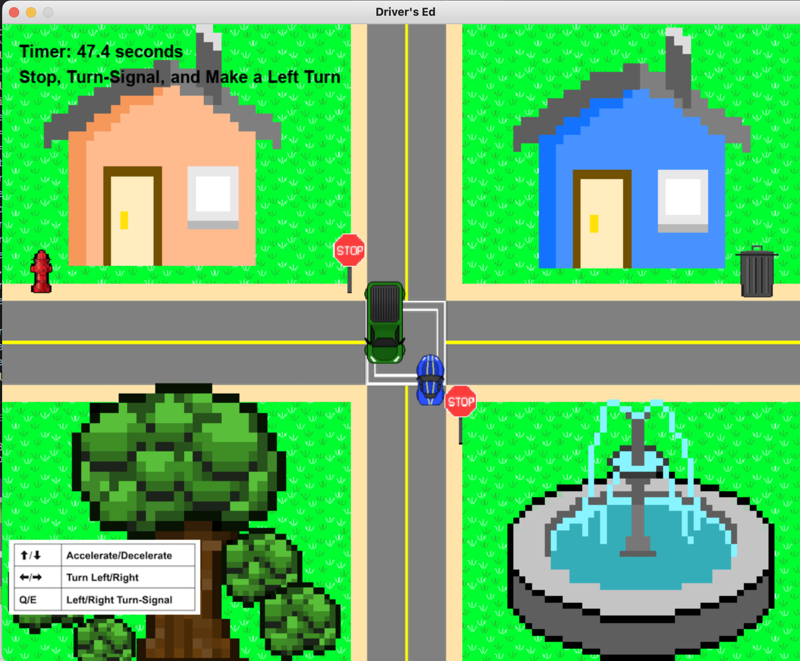
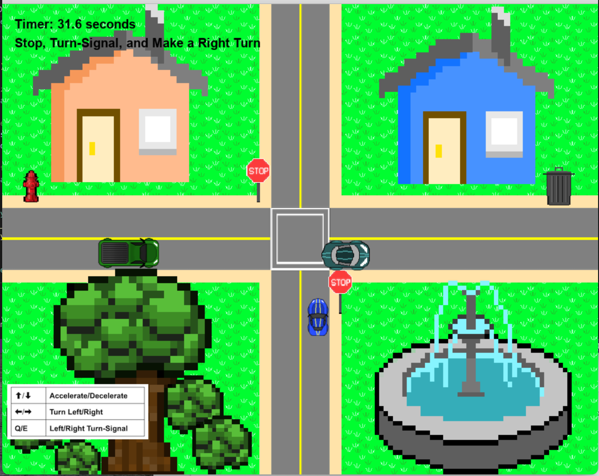

# CS269-DriversEd
New drivers constantly struggle with timing. Do I lane change now, is there enough room, when do I enter an intersection? Using three levels of increasing difficulty, Driver’s Ed teaches players how to drive in stressful situations by emphasizing timing. Additionally, drivers will get in the habit of signaling before turning, looking in all directions at an intersection, and being mindful of where to stop before entering an intersection. 

I worked alongside Trey Tuscai (Colby '25), Matthew Daddona (Colby '26), and Joshua Zhang (Colby '26). In my role as the designer, I created the overall vision for the game, basically, what each level should accomplish. The first level gets the player used to the controls and checks if the player stopped at the stop sign. Then, the second level builds on this, by having the user signal left and wait for an automated car to cross the intersection. Finally, the players turns right for level three but has to do so while oncoming traffic continues at an irregular pace. 

Image of Level 1

Image of Level 2

Image of Level 3

In my role as a producer, I organized meeting times, assigned deadlines to each member of the group, and created the final presentation that included a demo video (shown below). Additionally, I drew the road pixel art using Photopea (broswer version of Photoshop) and the futuristic teal car (with the help of Josh Zhang). Finally, I coded the game over scene, detected when the player's car passed a certain point to transition to the next level, placed down images onto the map, coded sound effects into the game, and game tested. 

https://github.com/AKWOK15/CS269-DriversEd/assets/121518425/16af8f83-6beb-46d2-bf8a-3a81483796ce

